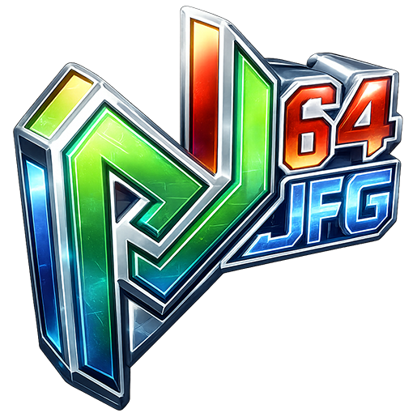

<p align="center">
  
</p>

# Project64JFG

*Project64 – Jet Force Gemini Edition*

A Windows fork of [Project64](https://github.com/project64/project64) focused on
**Jet Force Gemini**, with a dedicated mouse-and-keyboard scheme and an optional
60 FPS mode.

> This is a personal project, not affiliated with or endorsed by Rare, Nintendo,
> or the Project64 team. **No ROM is included.**

- [Features](#features)
- [Controls](#controls)
- [Requirements](#requirements)
- [Installation](#installation)
- [Known limitations](#known-limitations)
- [Planned improvements](#planned-improvements)
- [Building](#building)
- [Jet Force Gemini hacking reference](#jet-force-gemini-hacking-reference)
- [Dependencies and bundled components](#dependencies-and-bundled-components)
- [Contributing and feedback](#contributing-and-feedback)
- [Credits](#credits)
- [License](#license)

## Features

### Mouse and keyboard gameplay

- Mouse look and aiming sampled at the video refresh rate, up to 60 Hz
- Aim sensitivity that scales with sniper zoom to preserve on-screen precision
- Raw mouse input while captured, bypassing Windows pointer acceleration
- Context-aware controls for normal play, manual aim, crouch, prone, boss aiming,
  and Floyd sections
- Optional 1.25x sprint with synchronised animation and footsteps
- Boss encounters turn the view from the reticle, the way the stock game does
  from the stick, rather than swinging the rail the player runs along
- Optional cutscene skip: with **Fast Cutscenes** enabled, press A or Start
  during a cinematic to skip it (retail builds)
- QWERTY and AZERTY layouts

### Performance and accuracy

- 60 FPS mode is the default, with a doubled per-frame CPU budget for demanding
  scenes; a 30 FPS compatibility mode remains available
- Switch between 60 and 30 FPS live in-game with **Numpad +** / **Numpad −**
- 60 FPS gameplay-speed corrections for enemies (movement and animation),
  Squaddies, race opponents, projectiles, and the water wake, so the higher
  frame rate matches the 30 FPS behaviour rather than running fast
- Save states remain usable with the gameplay patches enabled
- Source-built Win32 and x64 Parallel-RDP and Parallel-RSP plugins, with
  configurable RDP and Video Interface settings
- The Parallel-RSP vector unit builds with its SSSE3 and SSE4.1 paths on both
  architectures, instead of falling back to the scalar emulation on x64

### Fixes and quality of life

- Restored 3D rendering behind the rain effect, fixing a black-screen issue
- More reliable audio: hardened against the crashes, stalls, and dropouts that
  could occur during heavy cutscenes, with click-free recovery when the frame
  rate dips
- Discord Rich Presence does not open on its own
- Jet Force Gemini options are grouped under
  *Options → Game-specific hacks → Jet Force Gemini*
- The Parallel-RDP graphics dialog includes a hardware-oriented preset and
  display, RDP, and VI controls

## Controls

The following mappings apply when **Keyboard/mouse controls** is enabled in the
Jet Force Gemini settings:

| Input | Action |
| --- | --- |
| W A S D | Move (`Z Q S D` on AZERTY) |
| Mouse | Look / aim |
| Left mouse button | Fire (N64 Z) |
| Right mouse button | Aim mode (N64 R) |
| E / F | N64 A / B |
| Mouse wheel up / down | N64 B / A — weapon cycling |
| Space / Ctrl | C-up / C-down |
| Left Shift | Sprint, when enabled; standing normal movement only |
| Enter | Start |
| E / Enter | Skip the current cutscene, when Fast Cutscenes is on |
| Numpad + / Numpad − | Switch to 60 / 30 FPS live |

When this option is enabled, the JFG scheme has exclusive control of N64
controller port 1: its regular plugin bindings are not sent to the game.

During crouch, Q/D are routed to N64 C-left/C-right. The equivalent prone
behaviour is configurable in the **Controls** tab. When **Floyd strafe** is
enabled, those same directions move Floyd sideways with the game's native
thrust acceleration and speed. Floyd otherwise uses contextual flight controls:
W/S (or E/F) control its A/B throttle and the mouse controls its reticle or
camera according to the selected Floyd option.

## Requirements

- 64-bit Windows 10 or 11.
- A Vulkan 1.3-capable GPU for Project64 Parallel-RDP.
- A supported **Jet Force Gemini** ROM — **not included**; dump it from your own
  cartridge.

The game-specific patches activate for these builds:

| | Retail | Kiosk demo |
| --- | --- | --- |
| Internal name | `JET FORCE GEMINI` | `J F G DISPLAY` |
| Cartridge ID | `NJFE` (USA) | — |
| Revision | 1.0 (version byte `0x00`) | demo |
| Internal CRC | `8A6009B6` `94ACE150` | `DFD8AB47` `3CDBEB89` |
| Size | 33,554,432 bytes (32 MiB) | 33,554,432 bytes (32 MiB) |

Each build has its own address table, so the same features run on both without a
separate code path. See [Docs/JFG_KIOSK_PORT.md](./Docs/JFG_KIOSK_PORT.md) for
how the Kiosk addresses were established.

<details>
<summary>Reference hashes</summary>

USA retail, big-endian image (`.z64`, native byte order):

| Hash | Value |
| --- | --- |
| MD5 | `772cc6eab2620d2d3cdc17bbc26c4f68` |
| SHA-1 | `493ced9008dbe932d6e91179b68e8630cf23a023` |

USA retail, byte-swapped image (`.n64`, v64 byte order):

| Hash | Value |
| --- | --- |
| MD5 | `0ef01afde32e40228c03904e3d884add` |
| SHA-1 | `aa7edc75952104f0b52bf1300df427835a128b01` |

Kiosk demo, big-endian image (`.z64`):

| Hash | Value |
| --- | --- |
| MD5 | `5bbe9ade7171f2e1daaa7c48fad38728` |
| SHA-1 | `f00f7c7fb085d0df57dcb649793aced5be4e8562` |

</details>

Either byte order loads: the emulator identifies the ROM by its internal CRC.

## Installation

1. Download the latest build from the [releases](../../releases) page.
2. Extract it anywhere.
3. Launch `Project64.exe` and open your Jet Force Gemini ROM.

The release includes the Project64 Parallel-RDP and Parallel-RSP pair, built
from the vendored sources. Select them together in the **Plugins** page.
The initial JFG profile uses English, keyboard/mouse controls, and the 60 FPS
mode with the recommended Jet Force Gemini defaults — fast cutscenes,
enemy-speed correction, crouch/prone stick-strafing, and sprint. All of these
can be changed under *Options → Game-specific hacks → Jet Force Gemini*.

## Known limitations

- Only the USA 1.0 and Kiosk demo builds listed above are supported by the
  game-specific patches. PAL and Japanese releases are not.
- The Kiosk demo has no landing cinematic, so the cinematic-skip option has
  nothing to act on there.

## Planned improvements

These items are planned work, not promises for a particular release:

- Support the PAL and Japanese releases of Jet Force Gemini.
- Add support for modern gamepads.

## Building

For development, install Git and Visual Studio 2022 with the **Desktop
development with C++** workload. The Parallel plugins additionally require
Python 3.12 or newer and MSYS2 in `C:\msys64`. In the MSYS2 UCRT64 shell,
install the tools used by the x64 Parallel plugins:

```
pacman -S --needed mingw-w64-ucrt-x86_64-toolchain mingw-w64-ucrt-x86_64-cmake mingw-w64-ucrt-x86_64-ninja
```

The Parallel-RDP and Parallel-RSP trees are vendored in this repository, so a
clone carries them already and nothing is fetched from upstream. SDL is the only
submodule left. Enable long paths before the first checkout: one vendored
SPIR-V-Cross test reference is past the classic Windows path limit, and Git
silently skips it otherwise.

```
git config --global core.longpaths true
git clone <repository-url>
cd <clone-directory>
git submodule update --init external/sdl
```

Open `Project64.sln` in Visual Studio, select `Release | x64` (or
`Release | Win32`), and build the `Project64` project. This builds the emulator
with the Project64 Audio and Project64 Input plugins. Set `Project64` as the
startup project to launch it with F5.

Parallel-RDP and Parallel-RSP are separate CMake projects. Rebuild their pair
only when you need to update those DLLs:

```
Source\Script\build_parallel_win32.cmd
Source\Script\build_parallel_x64.cmd
```

There is no automated release-packaging script. Assemble any distributable
manually from the rebuilt executable, required plugins, configuration, language,
and license files. A Vulkan 1.3-capable GPU and driver are required to run the
Parallel-RDP plugin. Further build-environment details are in
[Docs/BUILDING.md](./Docs/BUILDING.md).
## Jet Force Gemini hacking reference

For developers extending the game-specific runtime, the
[Jet Force Gemini hacking reference](./Docs/JET_FORCE_GEMINI_HACKING.md)
documents the supported ROM, address conventions, patch-safety rules, current
hooks, and the water-wake investigation status.

## Dependencies and bundled components

| Component | License |
| --- | --- |
| [Project64](https://github.com/project64/project64), Project64 Audio, and Project64 Input | GPL-2.0 |
| [Parallel-RDP](https://github.com/Themaister/parallel-rdp) | MIT |
| [Parallel-RSP](https://github.com/Themaister/parallel-rsp) | MIT (dual MIT / LGPLv3; MIT selected) |
| GNU Lightning, statically linked by Parallel-RSP | LGPLv3 (or GPLv3; LGPLv3 selected) |

`Source/Project64-parallel-rdp` and `Source/Project64-parallel-rsp` are local
Project64 plugin adapters. They build against the vendored
`external/parallel-rdp` and `external/parallel-rsp` trees and produce the Win32
and x64 DLLs distributed with this project. Their upstream bases and the
changes carried on top are recorded in
[Docs/PARALLEL_VENDOR_PROVENANCE.md](./Docs/PARALLEL_VENDOR_PROVENANCE.md).
Every public binary release must identify its immutable release tag as the
corresponding source; that tag contains the adapters, vendored sources, and
build scripts. Binary version metadata is fixed at `0.9`; it never incorporates
a Git commit, build number, or worktree state. The notices and the documented
rebuild path for the GNU
Lightning-linked RSP plugin are in [Licenses/](./Licenses).

Other bundled or linked components include SDL2, zlib, libpng, FreeType, 7-Zip,
Duktape, asmjit, softfloat, and the Windows Template Library. Their source and
notices remain under their respective licenses.

Reverse-engineering reference: the
[Jet Force Gemini decompilation](https://github.com/Ryan-Myers/Jet-Force-Gemini).

## Contributing and feedback

**I am not accepting code contributions at the moment**, so pull requests will
not be merged for now.

Bug reports and feedback are very welcome. Please open an [issue](../../issues)
with:

- ROM region and revision;
- enabled Jet Force Gemini options;
- a description of the issue and steps to reproduce it.

A save state taken just before the problem helps a lot.

## Credits

- The Project64 team and contributors, for the emulator this is built on
- Themaister, for Parallel-RDP and Parallel-RSP
- Ryan Myers and the Jet Force Gemini decompilation contributors, an invaluable
  reference for the game-specific work
- Jet Force Gemini is © Rare / Nintendo

## License

Project64JFG and the in-tree GPL-2.0 components are distributed under
[GPL-2.0](./license.md). The corresponding source for those components is this
repository at the immutable release tag named by the binary release. The
Parallel-RDP/RSP source and relinking notices are collected in
[Licenses/](./Licenses).
